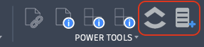
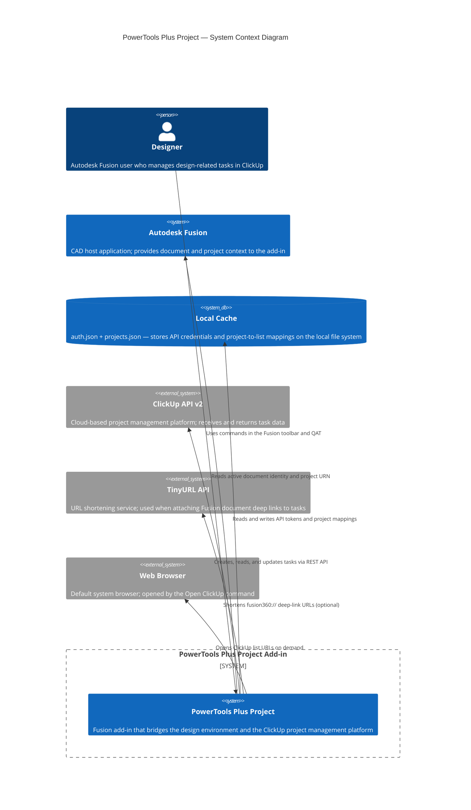

# PowerTools – Plus Project

PowerTools Plus Project is an Autodesk Fusion add-in that connects your design projects to [ClickUp](https://clickup.com), a cloud-based project management platform. Map any Fusion project to a ClickUp task list, open that list with a single click, and create or update ClickUp tasks without leaving the design environment.

---

## Commands

| Command | Location | Purpose |
|---|---|---|
| [Set ClickUp Tokens](docs/set-tokens.md) | QAT › PowerTools Settings | Store your ClickUp and TinyURL API credentials |
| [Map Project to ClickUp](docs/map-project.md) | QAT › PowerTools Settings | Link the active Fusion project to a ClickUp list |
| [Open ClickUp](docs/open-clickup.md) | Design workspace › PowerTools panel | Open the mapped ClickUp list in your browser |
| [Add ClickUp Task](docs/add-task.md) | Design workspace › PowerTools panel | Create a new ClickUp task from within Fusion |
| [List Tasks](docs/list-tasks.md) | Design workspace › PowerTools panel | View tasks linked to the active document and the full project list |
| [Update Tasks](docs/update-tasks.md) | Design workspace › PowerTools panel | Edit task name, due date, and priority for tasks linked to the active document |

---

## Installation

1. Download or clone this repository.
2. In Autodesk Fusion, open the **Scripts and Add-Ins** dialog (keyboard shortcut: `Shift+S`).
3. Select the **Add-Ins** tab, then select the **+** icon and browse to the repository folder.
4. Select **PowerTools-PlusProject** and select **Run**.

The add-in loads the **PowerTools** panel into the Design workspace toolbar and adds a **PowerTools Settings** flyout to the Quick Access Toolbar (QAT).

---

## First-time setup

Complete these two steps before using the toolbar commands.

### 1. Set API tokens

Run **Set ClickUp Tokens** from **QAT › PowerTools Settings** and enter your credentials:

- **ClickUp API Token** — Required for all commands that read or write ClickUp tasks. See [Getting Started with the ClickUp API](https://help.clickup.com/hc/en-us/articles/6303426241687-Getting-Started-with-the-ClickUp-API).
- **TinyURL API Token** — Required only when you use the **Link Document to Task** option in **Add ClickUp Task**. See [TinyURL Developer API](https://tinyurl.com/app/dev).

### 2. Map each Fusion project

For each Fusion project you want to connect to ClickUp:

1. Open any saved document that belongs to the project.
2. Run **Map Project to ClickUp** from **QAT › PowerTools Settings**.
3. Enter the ClickUp list URL and List ID for that project.

Repeat this step for each Fusion project you want to connect.

---

## Typical workflow

1. Create a corresponding ClickUp list for each Fusion project you want to track.
2. Run **Map Project to ClickUp** once per project to store the list URL and List ID.
3. While working in Fusion, use **Open ClickUp** to jump directly to the task list in your browser.
4. Use **Add ClickUp Task** to log new tasks. Optionally link the active Fusion document so teammates can open it directly from ClickUp.
5. Use **List Tasks** to review all tasks linked to the active document or the full project list.
6. Use **Update Tasks** to edit task name, due date, or priority without leaving Fusion.

---

## System architecture

The following diagram shows the high-level relationships between the add-in, Autodesk Fusion, the local cache, and the external services.

---

## Requirements

- Autodesk Fusion — any current subscription tier
- A ClickUp account with API access
- A TinyURL account with API access *(optional — required only for document linking)*

---

## Documentation

Full command reference is in the [`docs/`](docs/) folder.

| Document | Description |
|---|---|
| [Set ClickUp Tokens](docs/set-tokens.md) | Store API credentials for ClickUp and TinyURL |
| [Map Project to ClickUp](docs/map-project.md) | Link a Fusion project to a ClickUp list |
| [Open ClickUp](docs/open-clickup.md) | Open the mapped ClickUp list in the browser |
| [Add ClickUp Task](docs/add-task.md) | Create a task from within Fusion |
| [List Tasks](docs/list-tasks.md) | View document and project tasks |
| [Update Tasks](docs/update-tasks.md) | Edit task details from within Fusion |
| [Creating the Fusion Design Custom Field](docs/clickup-fusion-design-field.md) | Set up the ClickUp URL field for document linking |

---

## Cache files

The add-in stores runtime data locally in `cache/` at the add-in root. These files are excluded from source control and must not be shared.

| File | Contents |
|---|---|
| `cache/auth.json` | ClickUp and TinyURL API tokens |
| `cache/projects.json` | Fusion project URN → ClickUp list mappings |

> [!WARNING]
> `cache/auth.json` contains API tokens stored in plain text. Do not share this file or commit it to a repository.

---

## Support

This add-in is developed and maintained by IMA LLC.

---

## License

This project is released under the [MIT License](LICENSE).

---

*Copyright © 2026 IMA LLC. All rights reserved.*
