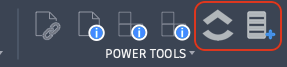

# PowerTools – Plus Project

PowerTools Plus Project is a Fusion 360 add-in that connects your design projects to [ClickUp](https://clickup.com) — the project management platform. Map any Fusion project to a ClickUp task list, jump directly to that list from within Fusion, and create new ClickUp tasks without leaving the design environment.

---

## Commands

| Command | Location | Purpose |
|---|---|---|
| [Set ClickUp Tokens](set-tokens.md) | QAT › PowerTools Settings | Store your ClickUp and TinyURL API keys |
| [Map Project to ClickUp](map-project.md) | QAT › PowerTools Settings | Link the active Fusion project to a ClickUp list |
| [Open ClickUp](open-clickup.md) | Design toolbar | Open the mapped ClickUp list in your browser |
| [Add ClickUp Task](add-task.md) | Design toolbar | Create a new ClickUp task from within Fusion |

---

## First-Time Setup

Complete these two steps once before using the toolbar commands.

### 1. Set API Tokens

Run **Set ClickUp Tokens** from **QAT › PowerTools Settings** and enter your credentials:

- **ClickUp API Token** — required for all commands. See [Getting your ClickUp API token](https://help.clickup.com/hc/en-us/articles/6303426241687-Getting-Started-with-the-ClickUp-API).
- **TinyURL API Token** — required to attach a document link when creating tasks. See [TinyURL Developer API](https://tinyurl.com/app/dev).

Tokens are saved locally to `cache/auth.json` inside the add-in folder.

### 2. Map Each Fusion Project

Open any saved document in a project, then run **Map Project to ClickUp**. Enter the ClickUp list URL and List ID for that project. Repeat for each Fusion project you want to connect.

Project mappings are saved locally to `cache/projects.json`.

---

## Requirements

- Autodesk Fusion — any current subscription tier
- A ClickUp account with API access
- A TinyURL account with API access *(optional — required only for document linking)*

---

## Cache Files

The add-in stores runtime data in the `cache/` folder at the add-in root. These files are not included in source control.

| File | Contents |
|---|---|
| `cache/auth.json` | ClickUp and TinyURL API tokens |
| `cache/projects.json` | Fusion project URN → ClickUp list mappings |
