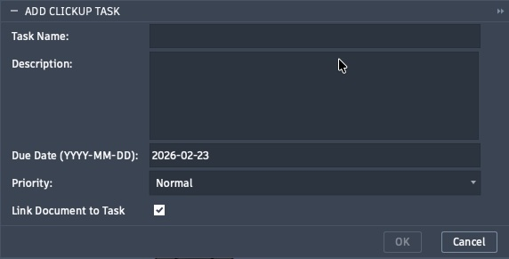
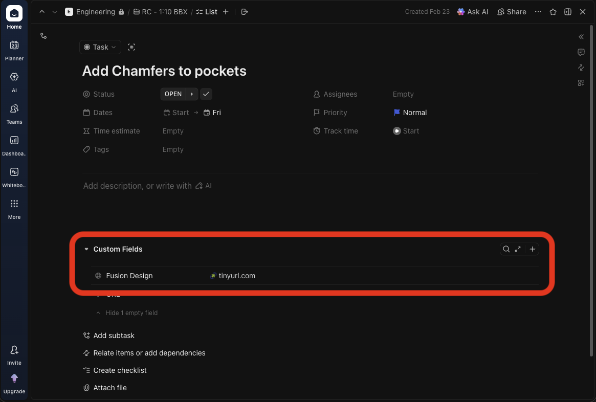

# Add ClickUp Task

Creates a new task in the ClickUp list mapped to the current Fusion 360 project. Optionally attaches a shortened "Open in Fusion" link to the task as a custom field.

**Location:** Design workspace › PowerTools panel › Add ClickUp Task

---

## Prerequisites

- `cache/auth.json` must exist with a valid `clickup_api_token`. Run **Set ClickUp Tokens** if it does not.
- `cache/projects.json` must exist with the active project mapped and a `clickup_list_id` set. Run **Map Project to ClickUp** if it does not.
- A saved Fusion 360 document must be open.

If either cache file is missing, the command displays a setup prompt and exits without opening the dialog.

---

## Dialog Fields

| Field | Required | Description |
|---|---|---|
| Task Name | Yes | Title of the new task |
| Description | No | Task body; supports Markdown |
| Due Date | No | Date in `YYYY-MM-DD` format; defaults to today |
| Priority | No | Normal (default), Low, High, or Urgent |
| Link Document to Task | No | When checked, attaches a shortened Fusion "Open on Desktop" URL to the task |

---

## Document Linking

When **Link Document to Task** is checked, the add-in:

1. Builds a `fusion360://` deep-link URL for the active document.
2. Shortens the URL via the TinyURL API using the token stored in `auth.json`.
3. Writes the short URL to a custom field named **Fusion Design** on the created task.

If the TinyURL token is missing or shortening fails, the task is created without the document link — no error is raised.

> **Requirement:** The ClickUp list must have a URL-type custom field named **Fusion Design** for the link to be attached. If the field is absent, the link is silently skipped.
> See [Creating the Fusion Design Custom Field](clickup-fusion-design-field.md) for setup instructions.

---

## Priority Values

| Label | ClickUp Priority |
|---|---|
| Urgent | 1 |
| High | 2 |
| Normal | 3 |
| Low | 4 |

---

## Behavior

1. Validates that both cache files exist; aborts with a setup message if either is missing.
2. Collects dialog inputs.
3. If **Link Document to Task** is checked, builds and shortens the document URL before posting.
4. Resolves the ClickUp List ID from `projects.json` using the active project URN.
5. POSTs to `https://api.clickup.com/api/v2/list/{list_id}/task`.
6. Displays a success message with a link to the newly created task, or an error message if the API call fails.

---

## Error Conditions

| Condition | Message |
|---|---|
| `auth.json` or `projects.json` missing | Setup Required — prompts to run Set Tokens and Map Project |
| ClickUp API token missing from `auth.json` | Authentication Error |
| Active project not mapped or no List ID | List ID Not Configured |
| No active saved document | Project Not Found |
| ClickUp API returns an error | Displays HTTP status and response body |
