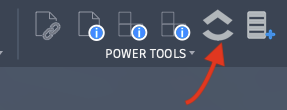
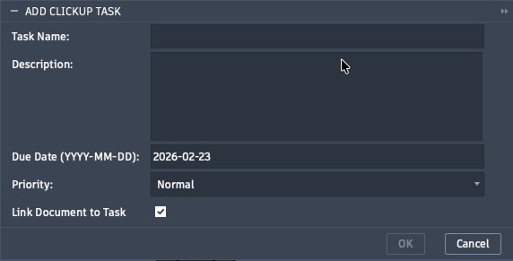
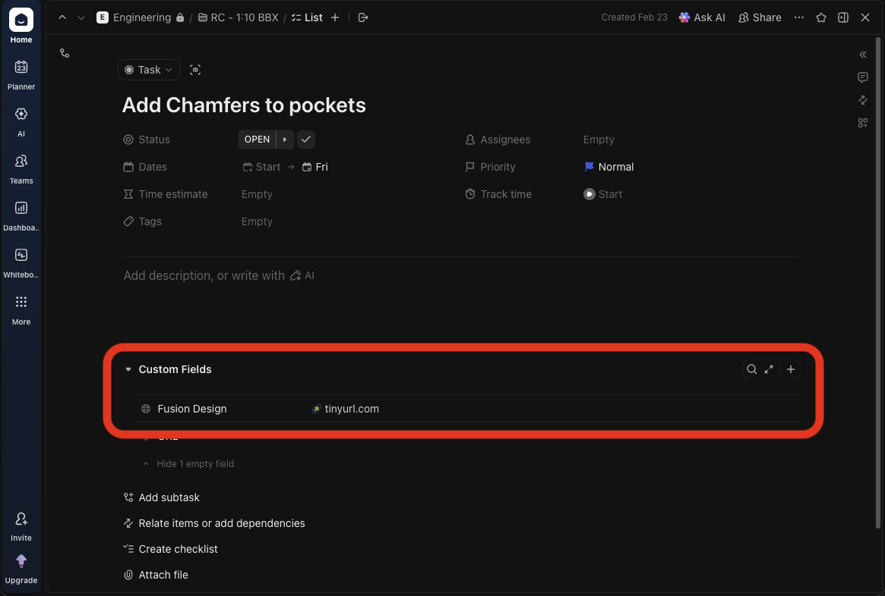
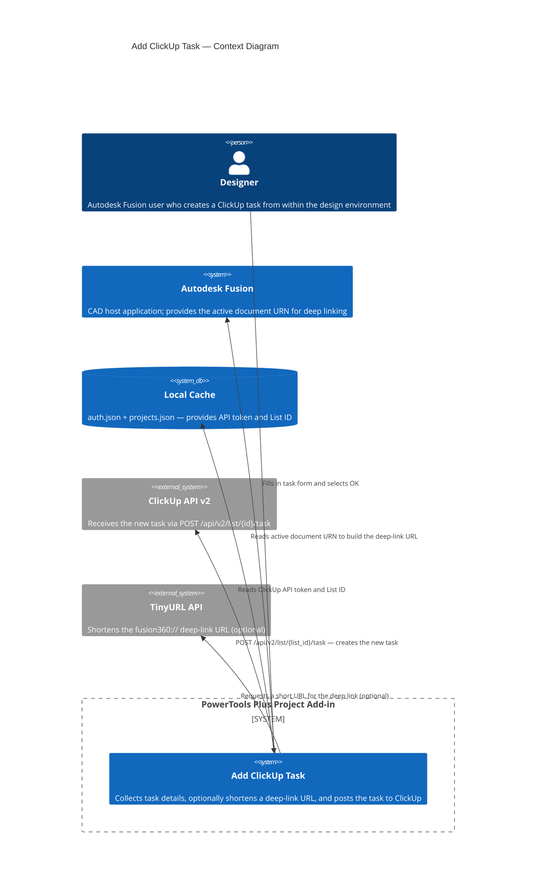

# Add ClickUp Task

Creates a new task in the ClickUp list that is mapped to the active Autodesk Fusion project. Optionally attaches a shortened "Open in Fusion" deep link to the task as a custom field.

**Location:** Design workspace › PowerTools panel › Add ClickUp Task

---

## Overview

**Add ClickUp Task** lets you create a ClickUp task without leaving Autodesk Fusion. You provide the task name, description, due date, and priority. Optionally, you can attach a link that your teammates can select in ClickUp to open the related Fusion document directly on their desktop.

---

## Prerequisites

- The PowerTools Plus Project add-in must be installed and running in Autodesk Fusion.
- `cache/auth.json` must exist and contain a valid `clickup_api_token`. Run **Set ClickUp Tokens** if it does not.
- `cache/projects.json` must exist and contain a mapping for the active project with a `clickup_list_id` value. Run **Map Project to ClickUp** if it does not.
- A saved Autodesk Fusion document must be open.

If either cache file is missing, the command displays a setup prompt and exits without opening the dialog.

---

## Dialog fields

| Field | Required | Description |
|---|---|---|
| Task Name | Yes | The title of the new ClickUp task. |
| Description | No | Body text for the task. Supports Markdown formatting. |
| Due Date | No | The target completion date in `YYYY-MM-DD` format. Defaults to today's date. |
| Priority | No | The task priority: **Normal** (default), **Low**, **High**, or **Urgent**. |
| Link Document to Task | No | When selected, the add-in shortens the active document's Fusion deep-link URL via TinyURL and writes it to the **Fusion Design** custom field on the created task. |

---

## Document linking

When you select **Link Document to Task**, the add-in performs the following steps:

1. Builds a `fusion360://` deep-link URL for the active document.
2. Shortens the URL by calling the TinyURL API with the token stored in `cache/auth.json`.
3. Writes the short URL to the **Fusion Design** custom field on the newly created task.

Selecting the URL in ClickUp opens the document directly in the Autodesk Fusion desktop application.

If the TinyURL token is missing or the shortening call fails, the task is still created. Only the document link is omitted — no error is displayed to the user.

> [!NOTE]
> The target ClickUp list must have a URL-type custom field named **Fusion Design** for the document link to be attached. If the field is absent, the link is silently skipped. See [Creating the Fusion Design Custom Field](clickup-fusion-design-field.md) for setup instructions.

---

## Priority reference

| Label | ClickUp API value |
|---|---|
| Urgent | 1 |
| High | 2 |
| Normal | 3 |
| Low | 4 |

---

## Behavior

When you select **OK**, the command performs the following steps:

1. Validates that both `cache/auth.json` and `cache/projects.json` exist. If either is missing, the command exits and displays a setup message.
2. Collects the values from the dialog fields.
3. If **Link Document to Task** is selected, builds and shortens the document URL before posting.
4. Resolves the ClickUp List ID from `projects.json` using the active project URN.
5. Posts the new task to `https://api.clickup.com/api/v2/list/{list_id}/task`.
6. Displays a success message that includes a link to the newly created task, or an error message if the API call fails.

---

## Error conditions

| Condition | Result |
|---|---|
| `auth.json` or `projects.json` is missing | A **Setup Required** message prompts you to run **Set Tokens** and **Map Project**. |
| `clickup_api_token` is missing from `auth.json` | An authentication error message is displayed. |
| The active project is not mapped or has no List ID | A **List ID Not Configured** message is displayed. |
| No active saved document is open | A **Project Not Found** message is displayed. |
| The ClickUp API returns an error | A message displays the HTTP status code and response body from the API. |

---

## Architecture

The following diagram shows how the **Add ClickUp Task** command interacts with the Fusion environment, local cache, and external APIs.

```mermaid
C4Context
    title Add ClickUp Task — Context Diagram

    Person(user, "Designer", "Autodesk Fusion user who creates a ClickUp task from within the design environment")

    System_Boundary(addin_boundary, "PowerTools Plus Project Add-in") {
        System(addin, "Add ClickUp Task", "Collects task details, optionally shortens a deep-link URL, and posts the task to ClickUp")
    }

    System(fusion, "Autodesk Fusion", "CAD host application; provides the active document URN for deep linking")
    SystemDb(cache, "Local Cache", "auth.json + projects.json — provides API token and List ID")
    System_Ext(clickup, "ClickUp API v2", "Receives the new task via POST /api/v2/list/{id}/task")
    System_Ext(tinyurl, "TinyURL API", "Shortens the fusion360:// deep-link URL (optional)")

    Rel(user, addin, "Fills in task form and selects OK")
    Rel(addin, fusion, "Reads active document URN to build the deep-link URL")
    Rel(addin, cache, "Reads ClickUp API token and List ID")
    Rel(addin, tinyurl, "Requests a short URL for the deep link (optional)")
    Rel(addin, clickup, "POST /api/v2/list/{list_id}/task — creates the new task")
```

---

## Related commands

| Command | Purpose |
|---|---|
| [Set ClickUp Tokens](set-tokens.md) | Store the API credentials required by this command |
| [Map Project to ClickUp](map-project.md) | Link the active Fusion project to a ClickUp list |
| [Creating the Fusion Design Custom Field](clickup-fusion-design-field.md) | Set up the custom URL field for document linking |
| [List Tasks](list-tasks.md) | View tasks linked to the active document |
| [Update Tasks](update-tasks.md) | Edit task name, due date, and priority from within Fusion |

---

*Copyright © 2026 IMA LLC. All rights reserved.*
