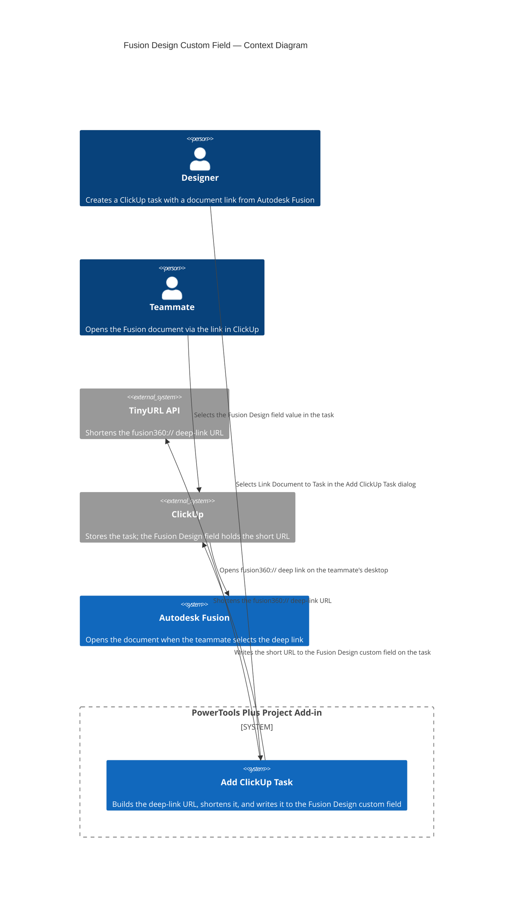

# Create the Fusion Design custom field in ClickUp

The **Add ClickUp Task** command can attach a shortened "Open in Fusion" deep-link URL directly to a newly created task. For this feature to work, the target ClickUp list must have a URL-type custom field named exactly **Fusion Design**.

You need to create this field once per ClickUp list that you use with the add-in.

---

## Overview

When a designer selects **Link Document to Task** in the **Add ClickUp Task** dialog, the add-in searches the target ClickUp list for a URL-type custom field named **Fusion Design**. If the field exists, the add-in writes a shortened `fusion360://` deep-link URL to that field on the newly created task. Anyone who views the task in ClickUp can then select the URL to open the linked Fusion document directly on their desktop.

---

## Prerequisites

- You must have permission to edit custom fields in the target ClickUp list.
- The list must already exist and be mapped to a Fusion project. See [Map Project to ClickUp](map-project.md).

---

## How to create the Fusion Design custom field

### Step 1 — Open the list's custom fields

1. In ClickUp, navigate to the **List** that is mapped to your Fusion project.
2. Select the **+** icon in the task table header, or right-click any column header, to open the custom fields menu.

### Step 2 — Add a new field

1. Select **+ Add Field** or **Create New** from the menu.

### Step 3 — Select the URL field type

1. In the field-type picker, select **URL**.

### Step 4 — Name the field

1. Enter the name **Fusion Design** exactly as shown here. Spelling and capitalization must match.
2. Leave all other options at their defaults.
3. Select **Create**.

> [!IMPORTANT]
> The field name must be `Fusion Design` with a capital **F** and a capital **D**. The add-in searches for this exact string when it looks up the field ID. A name mismatch causes the document link to be silently skipped — no error is shown.

### Step 5 — Confirm the field appears

After saving, the **Fusion Design** column should appear in your task list. You can drag it to a more convenient position in the table if needed.

---

## Repeat for each list

The custom field exists at the **List** level in ClickUp, not the Workspace or Space level. If you map multiple Fusion projects to different ClickUp lists, you must add the **Fusion Design** field to each list individually.

---

## How the field is used

When a designer selects **Link Document to Task** in the **Add ClickUp Task** dialog, the add-in performs the following steps:

1. Builds a `fusion360://` deep-link URL for the active Fusion document.
2. Shortens the link by calling the TinyURL API using the token stored in `cache/auth.json`.
3. Calls the ClickUp API to find the custom field whose name matches `Fusion Design` on the target list.
4. If the field is found, writes the short URL to that field on the newly created task.
5. Selecting the field value in ClickUp opens the document directly in the Autodesk Fusion desktop application.

If the **Fusion Design** field is missing or the TinyURL token is not configured, the task is still created. Only the document link is omitted.

---

## Architecture

The following diagram shows how the **Fusion Design** custom field fits into the document-linking workflow.

---

## Related

- [Add ClickUp Task](add-task.md)
- [Set ClickUp Tokens](set-tokens.md)
- [Map Project to ClickUp](map-project.md)

---

*Copyright © 2026 IMA LLC. All rights reserved.*
