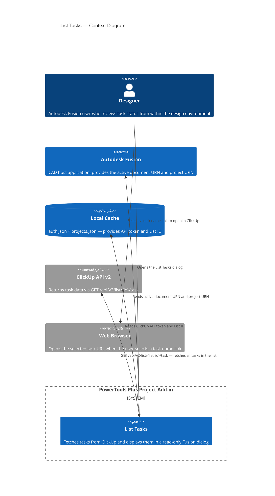

# List Tasks

Displays a read-only view of ClickUp tasks associated with the active Autodesk Fusion document and all tasks in the mapped project list. To make edits, use the **Update Tasks** command.

**Location:** Design workspace › PowerTools panel › List Tasks

---

## Overview

**List Tasks** provides a quick way to review the status and priority of ClickUp tasks without leaving Autodesk Fusion. The dialog shows two views: tasks that are specifically linked to the active Fusion document, and all tasks in the mapped ClickUp project list. Selecting a task name opens the ClickUp task directly in your browser.

---

## Prerequisites

- The PowerTools Plus Project add-in must be installed and running in Autodesk Fusion.
- `cache/auth.json` must exist and contain a valid `clickup_api_token`. Run **Set ClickUp Tokens** if it does not.
- `cache/projects.json` must exist and contain a mapping for the active project with a `clickup_list_id` value. Run **Map Project to ClickUp** if it does not.
- A saved Autodesk Fusion document must be open.
- The target ClickUp list must have a text custom field named **Fusion Document URN** for document-linked tasks to appear in the upper section. Tasks appear in this section only if they were created with the **Add ClickUp Task** command, which populates that field automatically.

If any required cache file is missing, the command displays a setup prompt and exits without opening the dialog.

---

## Dialog

The dialog is read-only and contains two sections separated by a link to the mapped ClickUp list.

### Tasks linked to this document

A table that shows only the tasks whose **Fusion Document URN** custom field exactly matches the URN of the active Fusion document. Tasks are sorted by priority (Urgent first).

### Project tasks

A table that shows all tasks in the mapped ClickUp list, regardless of whether they are linked to a specific document. Tasks are sorted by priority (Urgent first).

### Columns

Both tables display the same columns:

| Column | Description |
|---|---|
| Task Name | The title of the ClickUp task. Displays as a selectable link that opens the task in your browser. |
| Priority | The task priority: 🔴 Urgent, 🟠 High, 🔵 Normal, or ⚪ Low. |
| Status | The current ClickUp task status, as defined in your ClickUp workspace. |

---

## How to use List Tasks

1. Open a saved Autodesk Fusion document in a project that has been mapped to ClickUp.
2. On the **PowerTools** panel in the Design workspace toolbar, select **List Tasks**.
3. Review the tasks in the dialog.
4. To open a task in ClickUp, select the task name link in the table.
5. Select **OK** or **Cancel** to close the dialog.

---

## Architecture

The following diagram shows how the **List Tasks** command reads task data from ClickUp and displays it within Autodesk Fusion.

---

## Related commands

| Command | Purpose |
|---|---|
| [Add ClickUp Task](add-task.md) | Create a new task linked to the active document |
| [Update Tasks](update-tasks.md) | Edit task name, due date, and priority from within Fusion |
| [Open ClickUp](open-clickup.md) | Open the mapped ClickUp list in your browser |
