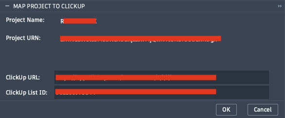

# Map Project to ClickUp

Links the active Fusion 360 project to a specific ClickUp list. This mapping is required before **Open ClickUp** or **Add ClickUp Task** can be used for the project.

**Location:** Quick Access Toolbar (QAT) › PowerTools Settings › Map Project to ClickUp



---

## Prerequisites

- A saved Fusion 360 document must be open (unsaved documents are rejected).
- A ClickUp list must already exist for the project.

---

## Fields

| Field | Editable | Description |
|---|---|---|
| Project Name | No | Fusion project name, populated automatically |
| Project URN | No | Fusion project identifier, populated automatically |
| ClickUp URL | Yes | Full URL of the ClickUp list or view to associate with this project |
| ClickUp List ID | Yes | Numeric List ID used by Add Task to post new tasks |

---

## Finding the ClickUp URL and List ID

1. In ClickUp, navigate to a **List** (not a Folder or Space).
2. Copy the full URL from your browser's address bar — paste this into **ClickUp URL**.
3. The List ID is the number that follows `/li/` in the URL.

**Example:**

```
https://app.clickup.com/XXXXXXXXXXX/v/l/li/1234567891011
                                           ^^^^^^^^^^^^^
                                  List ID: 1234567891011
```

<!--  -->

> **Important:** Use a URL that points to a **List**, not a Folder or a Space. Tasks cannot be created against a Folder or Space ID.

---

## Behavior

- Clicking **OK** writes the mapping to `cache/projects.json` keyed by the Fusion project URN.
- If the project is already mapped, the existing entry is updated; all other fields in the entry are preserved.
- The **OK** button is disabled until a ClickUp URL is entered.

---

## Storage Location

```
<add-in root>/cache/projects.json
```

```json
{
  "projects": {
    "<project-urn>": {
      "project_name": "My Project",
      "clickup_url": "https://app.clickup.com/...",
      "clickup_list_id": "1234567891011"
    }
  }
}
```
