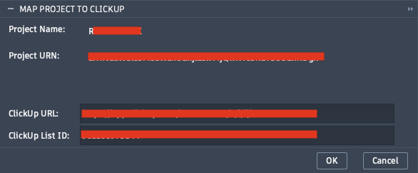
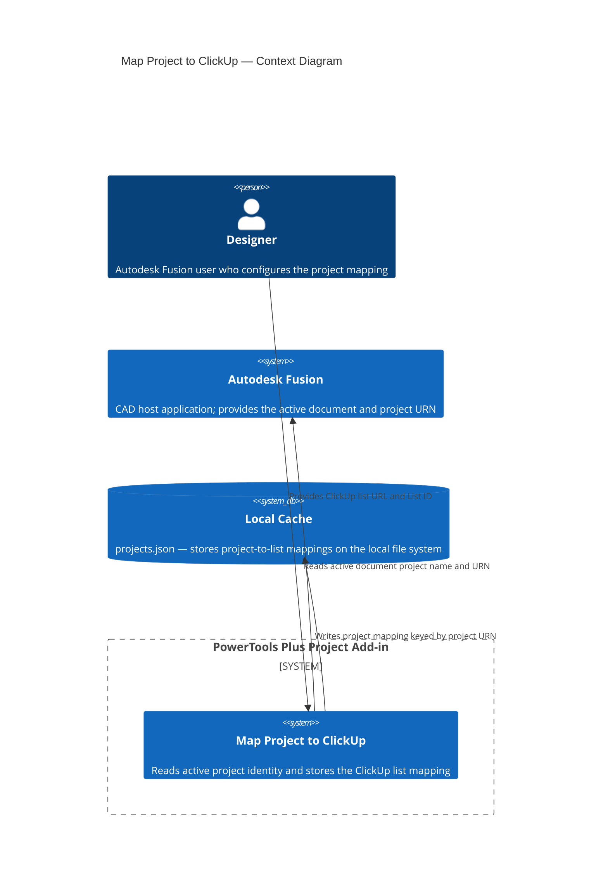

# Map Project to ClickUp

Links the active Autodesk Fusion project to a specific ClickUp list. You must complete this mapping before you can use the **Open ClickUp**, **Add ClickUp Task**, **List Tasks**, or **Update Tasks** commands for a given project.

**Location:** Quick Access Toolbar (QAT) › PowerTools Settings › Map Project to ClickUp



---

## Overview

Each Autodesk Fusion project must be mapped to a corresponding ClickUp list before the add-in can interact with that project's tasks. The **Map Project to ClickUp** command reads the active document's project identifier automatically and stores the association between the Fusion project and the ClickUp list you specify. You only need to run this command once per project.

---

## Prerequisites

- The PowerTools Plus Project add-in must be installed and running in Autodesk Fusion.
- A saved Autodesk Fusion document must be open. Unsaved (unnamed) documents are not accepted.
- A ClickUp list must already exist for the project you want to link.

---

## Fields

| Field | Editable | Description |
|---|---|---|
| Project Name | No | The name of the Fusion project that contains the active document. Populated automatically. |
| Project URN | No | The internal identifier for the Fusion project. Populated automatically. |
| ClickUp URL | Yes | The full URL of the ClickUp list or view you want to associate with this project. |
| ClickUp List ID | Yes | The numeric identifier for the ClickUp list. Used by the **Add ClickUp Task** command to create tasks against the correct list. |

---

## How to find the ClickUp URL and List ID

1. In ClickUp, navigate to the **List** you want to link. Do not select a Folder or a Space.
2. Copy the full URL from your browser's address bar and paste it into the **ClickUp URL** field.
3. Locate the **List ID** in the URL. The numeric value that follows `/li/` is the List ID.

**Example:**

```
https://app.clickup.com/XXXXXXXXXXX/v/l/li/1234567891011
                                                ^^^^^^^^^^^^^
                                       List ID: 1234567891011
```

> [!IMPORTANT]
> You must use a URL that points to a **List**, not a Folder or a Space. The add-in uses the List ID to create tasks with the ClickUp API. Tasks cannot be created against a Folder or Space ID.

---

## How to use Map Project to ClickUp

1. Open any saved document that belongs to the project you want to map.
2. Select **QAT › PowerTools Settings › Map Project to ClickUp**.
3. Verify that the **Project Name** and **Project URN** fields are populated correctly.
4. Enter the **ClickUp URL** for the list you want to link.
5. Enter the **ClickUp List ID**.
6. Select **OK**.

A confirmation message appears when the mapping is saved. Repeat this process for each Fusion project you want to connect to ClickUp.

---

## Behavior

- Selecting **OK** writes the mapping to `cache/projects.json` inside the add-in folder, keyed by the Fusion project URN.
- If the project is already mapped, the existing entry is updated. All other project entries are preserved.
- The **OK** button is disabled until you enter a value in the **ClickUp URL** field.

---

## Storage location

Project mappings are stored at the following path within the add-in root folder:

```
<add-in root>/cache/projects.json
```

The file uses the following format:

```json
{
  "projects": {
    "<project-urn>": {
      "project_name": "My Project",
      "clickup_url": "https://app.clickup.com/...",
      "clickup_list_id": "1234567891011"
    }
  }
}
```

---

## Architecture

The following diagram shows how the **Map Project to ClickUp** command reads from the Fusion environment and writes to the local cache.


```mermaid
C4Context
    title Map Project to ClickUp — Context Diagram

    Person(user, "Designer", "Autodesk Fusion user who configures the project mapping")

    System_Boundary(addin_boundary, "PowerTools Plus Project Add-in") {
        System(addin, "Map Project to ClickUp", "Reads active project identity and stores the ClickUp list mapping")
    }

    System(fusion, "Autodesk Fusion", "CAD host application; provides the active document and project URN")
    SystemDb(cache, "Local Cache", "projects.json — stores project-to-list mappings on the local file system")

    Rel(user, addin, "Provides ClickUp list URL and List ID")
    Rel(addin, fusion, "Reads active document project name and URN")
    Rel(addin, cache, "Writes project mapping keyed by project URN")
```

---

## Related commands

| Command | Purpose |
|---|---|
| [Set ClickUp Tokens](set-tokens.md) | Store the API credentials required by all commands |
| [Open ClickUp](open-clickup.md) | Open the mapped ClickUp list in your browser |
| [Add ClickUp Task](add-task.md) | Create a new ClickUp task in the mapped list |
