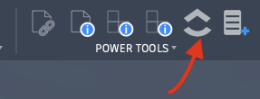

# Open ClickUp

Opens the ClickUp list mapped to the current Fusion 360 project in your default web browser. No dialog is shown — the browser opens immediately.

**Location:** Design workspace › PowerTools panel › Open ClickUp

---

## Prerequisites

- A saved Fusion 360 document must be open.
- The active project must be mapped via **Map Project to ClickUp**.

If the project is not yet mapped, a message will prompt you to run **Map Project to ClickUp** first.

---

## Behavior

1. Reads the active document's parent project URN.
2. Looks up the URN in `cache/projects.json`.
3. Opens the stored `clickup_url` in the default browser.

The command produces no confirmation dialog on success — the browser tab opening is the confirmation.

---

## Error Conditions

| Condition | Message |
|---|---|
| No document open | Prompts to open a saved Fusion document |
| Document is unsaved | Prompts to save the document |
| Project not mapped | Prompts to run Map Project to ClickUp |
| `projects.json` missing | Prompts to run Map Project to ClickUp |
| No URL stored for project | Prompts to re-run Map Project and set a URL |
