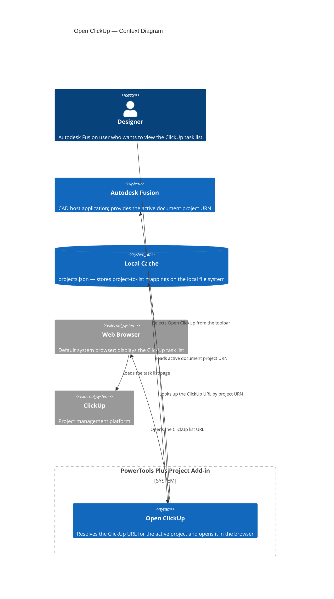

# Open ClickUp

Opens the ClickUp list that is mapped to the active Autodesk Fusion project in your default web browser. No dialog is shown — the browser opens immediately when you select the command.

**Location:** Design workspace › PowerTools panel › Open ClickUp

---

## Overview

**Open ClickUp** provides a one-click shortcut from your Fusion design environment to the ClickUp task list associated with the active project. The command looks up the ClickUp URL stored during project mapping and passes it directly to your default browser.

---

## Prerequisites

- The PowerTools Plus Project add-in must be installed and running in Autodesk Fusion.
- A saved Autodesk Fusion document must be open.
- The active project must be mapped to a ClickUp list. Run **Map Project to ClickUp** if you have not done so.

---

## How to use Open ClickUp

1. Open a saved Autodesk Fusion document in a project that has been mapped to ClickUp.
2. On the **PowerTools** panel in the Design workspace toolbar, select **Open ClickUp**.
3. Your default web browser opens and loads the mapped ClickUp list.

No confirmation dialog appears on success. The browser tab opening is the confirmation that the command ran successfully.

---

## Behavior

When the command runs, it performs the following steps:

1. Reads the active document's parent project URN from the Autodesk Fusion API.
2. Looks up the URN in `cache/projects.json`.
3. Opens the stored `clickup_url` value in your default system browser.

---

## Error conditions

| Condition | Result |
|---|---|
| No document is open | A message prompts you to open a saved Fusion document. |
| The document has not been saved | A message prompts you to save the document first. |
| The active project has not been mapped | A message prompts you to run **Map Project to ClickUp**. |
| `cache/projects.json` is missing | A message prompts you to run **Map Project to ClickUp**. |
| No URL is stored for the project | A message prompts you to re-run **Map Project to ClickUp** and set a URL. |

---

## Architecture

The following diagram shows how the **Open ClickUp** command reads from the Fusion environment and the local cache to open the browser.

```mermaid
C4Context
    title Open ClickUp — Context Diagram

    Person(user, "Designer", "Autodesk Fusion user who wants to view the ClickUp task list")

    System_Boundary(addin_boundary, "PowerTools Plus Project Add-in") {
        System(addin, "Open ClickUp", "Resolves the ClickUp URL for the active project and opens it in the browser")
    }

    System(fusion, "Autodesk Fusion", "CAD host application; provides the active document project URN")
    SystemDb(cache, "Local Cache", "projects.json — stores project-to-list mappings on the local file system")
    System_Ext(browser, "Web Browser", "Default system browser; displays the ClickUp task list")
    System_Ext(clickup, "ClickUp", "Project management platform")

    Rel(user, addin, "Selects Open ClickUp from the toolbar")
    Rel(addin, fusion, "Reads active document project URN")
    Rel(addin, cache, "Looks up the ClickUp URL by project URN")
    Rel(addin, browser, "Opens the ClickUp list URL")
    Rel(browser, clickup, "Loads the task list page")
```

---

## Related commands

| Command | Purpose |
|---|---|
| [Map Project to ClickUp](map-project.md) | Link the active Fusion project to a ClickUp list |
| [Add ClickUp Task](add-task.md) | Create a new task in the mapped ClickUp list |
| [List Tasks](list-tasks.md) | View tasks linked to the active document from within Fusion |

---

*Copyright © 2026 IMA LLC. All rights reserved.*
