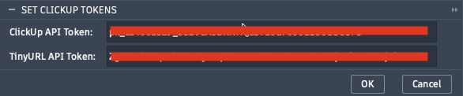

# Set ClickUp Tokens

Stores your ClickUp and TinyURL API credentials in the local add-in cache. This command must be run once before any other Plus Project command will function.

**Location:** Quick Access Toolbar (QAT) › PowerTools Settings › Set ClickUp Tokens



---

## Fields

| Field | Required | Description |
|---|---|---|
| ClickUp API Token | Yes | Personal API token from your ClickUp account |
| TinyURL API Token | No | API token from your TinyURL account; required only when using **Link Document to Task** in Add Task |

---

## Getting Your Tokens

**ClickUp API Token**

1. Log in to ClickUp.
2. Navigate to your avatar → **Settings** → **Apps**.
3. Under **API Token**, click **Generate** (or copy an existing token).
4. Paste the token into the **ClickUp API Token** field.

Full instructions: [Getting Started with the ClickUp API](https://help.clickup.com/hc/en-us/articles/6303426241687-Getting-Started-with-the-ClickUp-API)

<!--  -->

---

**TinyURL API Token**

1. Log in or register at [tinyurl.com](https://tinyurl.com).
2. Go to [tinyurl.com/app/dev](https://tinyurl.com/app/dev).
3. Copy your API token.
4. Paste it into the **TinyURL API Token** field.

<!--  -->

---

## Behavior

- Clicking **OK** writes both tokens to `cache/auth.json` inside the add-in folder.
- If `auth.json` already exists, only the token fields are updated; any other keys are preserved.
- Leaving a field blank skips writing that token — the existing value is retained.
- A confirmation dialog confirms a successful save.

---

## Storage Location

```
<add-in root>/cache/auth.json
```

```json
{
  "clickup_api_token": "pk_...",
  "tinyurl_api_token": "..."
}
```

> **Note:** `auth.json` is not included in source control. Keep your tokens private. When set these tokens are currently stored in clear text.
