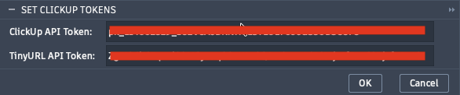
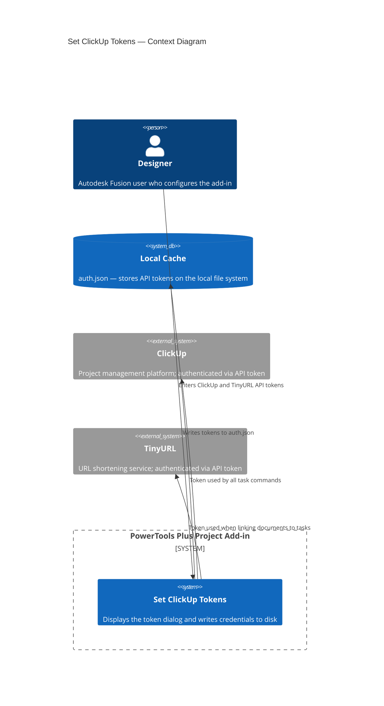

# Set ClickUp Tokens

Stores your ClickUp and TinyURL API credentials in the local add-in cache. You must run this command once before any other PowerTools Plus Project command can function.

**Location:** Quick Access Toolbar (QAT) › PowerTools Settings › Set ClickUp Tokens



---

## Overview

The **Set ClickUp Tokens** command opens a two-field dialog where you enter your API credentials. When you click **OK**, the add-in saves the tokens to a local JSON file (`cache/auth.json`) inside the add-in folder. The saved tokens are then available to all other commands in the add-in without requiring you to enter them again.

---

## Prerequisites

- The PowerTools Plus Project add-in must be installed and running in Autodesk Fusion.
- You must have a ClickUp account with API access.
- A TinyURL account is optional but required if you want to attach document links to tasks.

---

## Fields

| Field | Required | Description |
|---|---|---|
| ClickUp API Token | Yes | Your personal API token from ClickUp. Required for all commands that read or write ClickUp tasks. |
| TinyURL API Token | No | Your API token from TinyURL. Required only when you use the **Link Document to Task** option in the **Add ClickUp Task** command. |

---

## How to get your tokens

### ClickUp API Token

1. Sign in to [ClickUp](https://app.clickup.com).
2. Select your avatar in the lower-left corner, then select **Settings**.
3. Select **Apps** in the left navigation.
4. Under **API Token**, select **Generate** to create a new token, or copy the existing token.
5. Paste the token into the **ClickUp API Token** field in the dialog.

For more information, see [Getting Started with the ClickUp API](https://help.clickup.com/hc/en-us/articles/6303426241687-Getting-Started-with-the-ClickUp-API).

### TinyURL API Token

1. Sign in or register at [tinyurl.com](https://tinyurl.com).
2. Go to [tinyurl.com/app/dev](https://tinyurl.com/app/dev).
3. Copy your API token from the developer page.
4. Paste it into the **TinyURL API Token** field in the dialog.

For more information, see the [TinyURL Developer API](https://tinyurl.com/app/dev).

---

## Behavior

- Selecting **OK** writes both tokens to `cache/auth.json` inside the add-in folder.
- If `cache/auth.json` already exists, the add-in updates only the token fields. Any other keys in the file are preserved.
- Leaving a field blank skips writing that token. The existing value for that field is retained.
- A confirmation message appears when the tokens are saved successfully.

---

## Storage location

Tokens are stored at the following path within the add-in root folder:

```
<add-in root>/cache/auth.json
```

The file uses the following format:

```json
{
  "clickup_api_token": "pk_...",
  "tinyurl_api_token": "..."
}
```

> [!WARNING]
> `auth.json` is not included in source control. Tokens are stored in plain text. Do not share this file or commit it to a repository.

---

## Architecture

The following diagram shows how the **Set ClickUp Tokens** command interacts with the host environment and external services.


```mermaid
C4Context
    title Set ClickUp Tokens — Context Diagram

    Person(user, "Designer", "Autodesk Fusion user who configures the add-in")

    System_Boundary(addin_boundary, "PowerTools Plus Project Add-in") {
        System(addin, "Set ClickUp Tokens", "Displays the token dialog and writes credentials to disk")
    }

    SystemDb(cache, "Local Cache", "auth.json — stores API tokens on the local file system")

    System_Ext(clickup, "ClickUp", "Project management platform; authenticated via API token")
    System_Ext(tinyurl, "TinyURL", "URL shortening service; authenticated via API token")

    Rel(user, addin, "Enters ClickUp and TinyURL API tokens")
    Rel(addin, cache, "Writes tokens to auth.json")
    Rel(addin, clickup, "Token used by all task commands")
    Rel(addin, tinyurl, "Token used when linking documents to tasks")
```

---

## Related commands

| Command | Purpose |
|---|---|
| [Map Project to ClickUp](map-project.md) | Link the active Fusion project to a ClickUp list |
| [Add ClickUp Task](add-task.md) | Create a task that uses the saved ClickUp token |
| [Creating the Fusion Design Custom Field](clickup-fusion-design-field.md) | Set up document linking in ClickUp |

---

*Copyright © 2026 IMA LLC. All rights reserved.*
