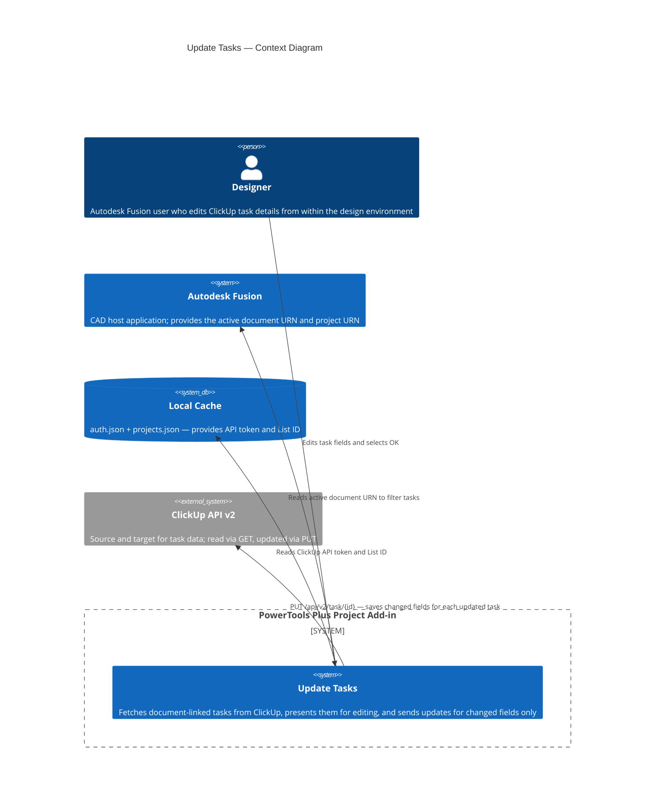

# Update Tasks

Displays and edits ClickUp tasks that are linked to the active Autodesk Fusion document. Changes to task name, due date, and priority are saved directly to ClickUp when you select **OK**.

**Location:** Design workspace › PowerTools panel › Update Tasks

---

## Overview

**Update Tasks** lets you edit the most common task fields without switching to the ClickUp web application. The dialog shows only the tasks that are linked to the active Fusion document. The command compares your edits to the original values and sends API updates only for fields that changed, minimizing unnecessary API calls.

---

## Prerequisites

- The PowerTools Plus Project add-in must be installed and running in Autodesk Fusion.
- `cache/auth.json` must exist and contain a valid `clickup_api_token`. Run **Set ClickUp Tokens** if it does not.
- `cache/projects.json` must exist and contain a mapping for the active project with a `clickup_list_id` value. Run **Map Project to ClickUp** if it does not.
- A saved Autodesk Fusion document must be open.
- The target ClickUp list must have a text custom field named **Fusion Document URN**. Tasks appear in the dialog only if they were originally created with the **Add ClickUp Task** command, which populates that field automatically.

If any required cache file is missing, the command displays a setup prompt and exits without opening the dialog.

---

## Dialog

The dialog shows all ClickUp tasks whose **Fusion Document URN** custom field exactly matches the URN of the active Autodesk Fusion document. Tasks are sorted by priority from Urgent to Low.

| Column | Editable | Description |
|---|---|---|
| Task Name | Yes | The ClickUp task title. |
| Due Date | Yes | The target completion date in `YYYY-MM-DD` format. Leave blank to clear an existing due date. |
| Priority | Yes | **Urgent**, **High**, **Normal**, or **Low**. |
| Status | No | The current ClickUp task status. This field is read-only. To change status, open the task directly in ClickUp. |

A link to the mapped ClickUp list appears at the top of the dialog.

---

## How to use Update Tasks

1. Open a saved Autodesk Fusion document in a project that has been mapped to ClickUp.
2. On the **PowerTools** panel in the Design workspace toolbar, select **Update Tasks**.
3. Review the tasks shown in the dialog.
4. Edit the **Task Name**, **Due Date**, or **Priority** fields as needed.
5. Select **OK** to save your changes to ClickUp.

A summary message reports how many tasks were updated successfully and flags any failures. Select **Cancel** to close the dialog without saving any changes.

---

## Due date validation

The **Due Date** field is validated before the dialog allows you to select **OK**:

| Input | Behavior |
|---|---|
| Blank | Allowed. Clears the existing due date on the task in ClickUp. |
| `YYYY-MM-DD` | Required format when a value is entered. |
| Any other format | The **OK** button is disabled until you correct the value. |

---

## Status field

Task status values are workspace-specific in ClickUp and cannot be reliably enumerated without additional API calls. The **Status** column is displayed for reference only. To change a task's status, open the task directly in ClickUp by selecting the task name link visible in the task tooltip.

---

## API calls used by this command

| Call | Purpose |
|---|---|
| `GET /api/v2/list/{list_id}/task` | Fetches tasks from the mapped list, filtered by the **Fusion Document URN** custom field. |
| `GET /api/v2/list/{list_id}/field` | Locates the **Fusion Document URN** field ID in the list. |
| `PUT /api/v2/task/{task_id}` | Updates changed fields on each individual task. |

For full payload details, see [ClickUp API — Update Task](https://developer.clickup.com/reference/updatetask).

---

## Architecture

The following diagram shows how the **Update Tasks** command reads and writes task data through the ClickUp API.

---

## Related commands

| Command | Purpose |
|---|---|
| [Add ClickUp Task](add-task.md) | Create a new task linked to the active document |
| [List Tasks](list-tasks.md) | Read-only view of document tasks and the full project list |
| [Open ClickUp](open-clickup.md) | Open the mapped ClickUp list in your browser |

---

*Copyright © 2026 IMA LLC. All rights reserved.*
